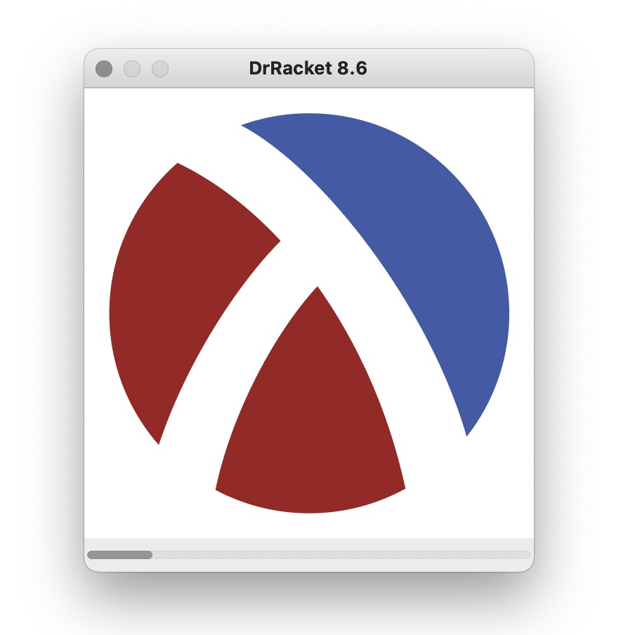
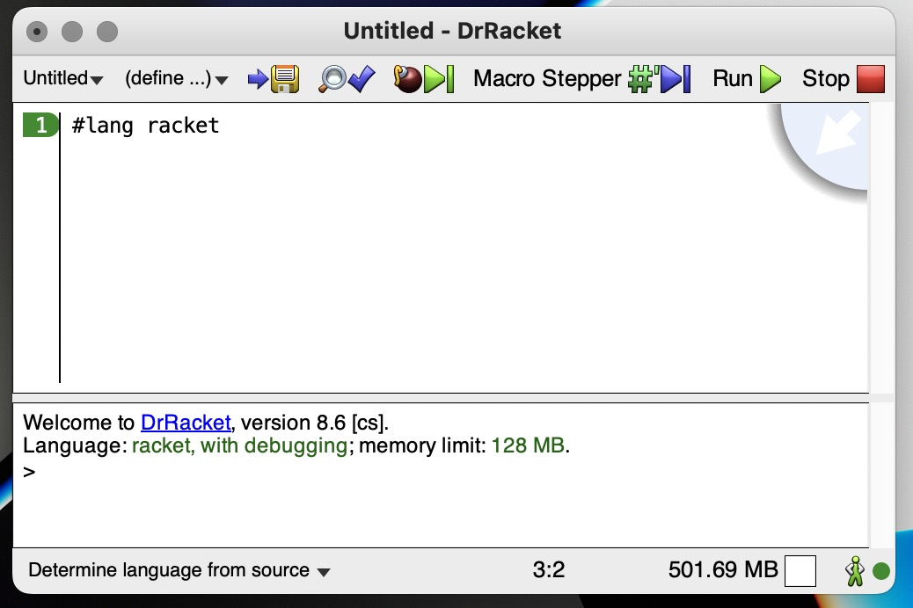
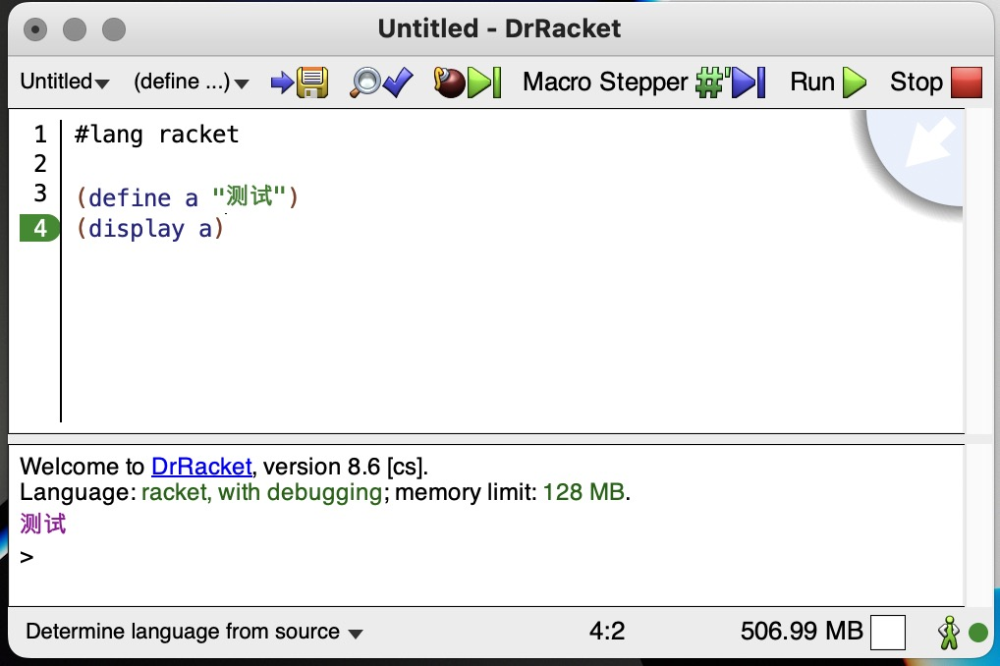
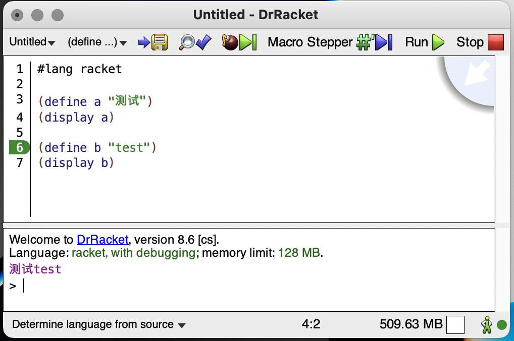

# 安装 Racket & Hello Scheme

Scheme 编程语言是一门 Lisp 方言，为了方便学习 Scheme 语言，我们先安装一个 Scheme 编程语言的解释器 Racket。

Racket 的官方网站是：https://www.racket-lang.org/

下载Racket：https://download.racket-lang.org/

安装完成后，启动 DrRacket 程序。如图所示：



启动成功后，我们就进入了IDE:



现在，可以开始编写 scheme 代码，我们暂时不修改默认的`#lang racket`，添加两行代码：



点击右上角的`Run`按钮后，底部输出了 `测试` 字符串。现在，我们再添加两行代码：



点击右上角的`Run`按钮后，底部输出了 `测试test` 字符串。

现在，我们不解释代码的含义，仅仅根据代码的行为，下面哪个选项 **不能** 输出字符串`Hello,World!`?


## 答案

```scheme
(define hello "你好")
(display hello)

(define world "世界!")
(display world)
```

## 选项

### A

```scheme
(define hello "Hello")
(display hello )

(define world ",World!")
(display world )
```

### B

```scheme
(define hello-world "Hello,World!")
(display hello-world )
```

### C

```scheme
(define hello "Hello")
(display hello)

(define comma ",")
(display comma)

(define world "World")
(display world)

(define exclamation "!")
(display exclamation)
```

### D

```scheme
(define hello-w "Hello,W")
(display hello-w)

(define orld "orld!)
(display orld)
```
